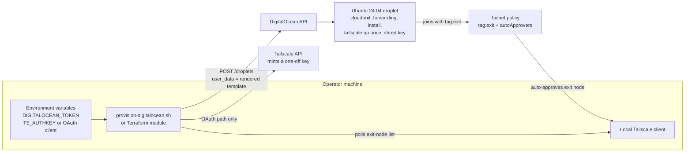

# tailscale-exit-node

Infrastructure-as-code to give a Tailscale tailnet an exit node on DigitalOcean (Terraform + bash), with env-only secrets, dry-run mode and post-provision verification.

## Why it exists

An exit node lets your devices send their internet traffic out through another machine: a fixed IP address, a different country, or just not the café Wi-Fi. You can get one without buying hardware in two ways: rent Mullvad's servers through Tailscale's add-on, or run a small cloud server yourself.

This project started from a short two-method write-up that had the right idea but a number of wrong details. It carried no byline and its source wasn't recorded, so it isn't reproduced here; the corrections log quotes only the claims it corrects. I had an AI coding agent check it line by line against Tailscale's and DigitalOcean's documentation, reviewed the findings, and kept a log of every correction. Then I automated the "run it yourself" path, so a new server boots straight into being an approved exit node without anyone clicking through the admin console. Credentials never appear in shell history or the process list. They reach disk only in `0600` scratch files that are wiped on exit, in Terraform state (Terraform path), and in a rendered first-boot file if you ask for one with `--render-out`.

## What it demonstrates

- **Secrets as a design constraint, not an afterthought.** Credentials come only from environment variables. API tokens reach curl through a config file read from stdin (`curl -K -`), never through argv. Request bodies (which can hold the auth key or an OAuth client secret) live in `0600` files in a private scratch directory that's wiped on exit. The Tailscale auth key is single-use, tagged and non-ephemeral. When the script or Terraform mints it through an OAuth client, it is also pre-approved and expires after 15 minutes. A key made by hand in the admin console lasts at least a day (the console's minimum) and is pre-approved only if device approval is on for the tailnet. The key is base64-encoded into the first-boot file, written to a root-only file on the server, and that file is shredded right after `tailscale up`. Other copies remain: cloud-init keeps the user data under `/var/lib/cloud/instance/`, and DigitalOcean's metadata service serves it for the droplet's lifetime. By then the key has been used once, so it can't register another machine.
- **Governance through policy as code.** A tailnet policy snippet defines `tag:exit`, who may assign it, and an `autoApprovers` rule that accepts tagged machines as exit nodes. The ordering constraint is built into the code: the policy has to exist before the node registers, so the Terraform key depends on the policy resource even when that resource is switched off. Letting Terraform own the whole policy (`manage_acl`) is off by default, because doing so replaces every existing rule.
- **Verification at every stage.** `--dry-run` prints the exact API request with the user data redacted, and `--offline` makes no network calls at all. After a real run, the script polls the local Tailscale client until the node appears as an exit node. It tells "joined but not approved" apart from "never joined" and exits with its own code (3) when the node hasn't shown up. `validate-local.sh` runs 8 groups of offline checks (details below).
- **One contract, two implementations.** A bash script and a Terraform module create the same server from the same cloud-init template and the same policy rules.
- **Documentation checked against primary sources.** [GUIDE.md](GUIDE.md) has a 19-row corrections log. Each row records what the original said, what's actually true, the source, and whether the original was wrong, misleading or out of date.

## Architecture



| Path | What's there |
|---|---|
| [`automation/scripts/`](automation/scripts) | `provision-digitalocean.sh`, `destroy-digitalocean.sh`, `validate-local.sh`, and `lib/common.sh` (HTTP, JSON and scratch-directory helpers) |
| [`automation/terraform/`](automation/terraform/README.md) | The Terraform/OpenTofu module (DigitalOcean + Tailscale providers) and `terraform.tfvars.example` |
| [`automation/cloud-init/`](automation/cloud-init/cloud-init.yaml.tpl) | The first-boot template both paths share, commented line by line |
| [`automation/policy/`](automation/policy) | A snippet to merge into your tailnet policy, and a complete example policy |
| [`GUIDE.md`](GUIDE.md) | The corrected guide: how exit nodes work, Mullvad vs. your own server, corrections log, sources |
| [`RUNBOOK.md`](RUNBOOK.md) | A step-by-step walkthrough with checkpoints. Each step is labelled as done by the human operator or by the AI assistant |
| [`site/index.html`](site/index.html) | The guide as a single web page with a "which one is for me" helper. It's an HTML fragment with no `<html>`/`<head>` tags; browsers render it as is |

## Key design decisions

1. **Run `tailscale up` exactly once, at first boot, with every flag.** `up` doesn't remember flags between runs, so a later bare `tailscale up` quietly stops the server being an exit node. Every later change goes through `tailscale set`, which only touches the setting you name.
2. **Use a tagged, non-ephemeral, single-use, pre-approved key with a short expiry.** The tag triggers auto-approval and turns off the 180-day node-key expiry. The key is non-ephemeral because ephemeral nodes are deleted after an hour idle. Single-use and a 15-minute expiry mean the cleartext copy in Terraform state is worthless almost immediately.
3. **Set up the policy before the server.** Auto-approval only applies to machines that register after the rule exists. The docs say this, and the Terraform dependency graph enforces it.
4. **Keep dependencies to bash 3.2, curl and python3's standard library.** All three ship with macOS. jq is deliberately not needed, so there's a single code path everywhere.
5. **Ignore `user_data` changes after the droplet is created.** Otherwise an expired key would force DigitalOcean to replace a working droplet on the next `apply`. You rebuild on purpose with `-replace`.
6. **Keep the renderer strict.** The key is base64-encoded so no character in it can break the YAML. The renderer refuses unknown placeholders, leftover `${`, a missing `#cloud-config` header and anything over DigitalOcean's 64 KiB user-data limit.
7. **Leave the firewall defaults alone and turn IPv6 on explicitly.** Default deny-forwarding is what Tailscale expects. DigitalOcean leaves IPv6 off unless you ask for it.

## How to run / test

**Offline checks (no cloud account, nothing created):**

```bash
automation/scripts/validate-local.sh
```

The checks:

1. The scripts parse under `/bin/bash` 3.2.
2. `shellcheck` finds nothing.
3. An offline dry run exits 0, redacts `user_data` and never prints the key. The same step confirms bad keys, bad names and unknown flags are refused.
4. The rendered cloud-init file parses as YAML, and the key survives the base64 round trip.
5. The policy files are valid HuJSON and contain the required keys.
6. `tofu fmt -check`, `tofu init -backend=false` and `tofu validate` pass.
7. The web page's tags are balanced.
8. Every local Markdown link resolves.

`shellcheck` and OpenTofu/Terraform are optional; the script skips those checks if they're missing. `tofu init` needs network access to download providers. The YAML check uses the system `/usr/bin/ruby`, which ships with macOS.

**Dry run against the real APIs (read-only calls, creates nothing):**

```bash
cd automation/scripts
read -rs DIGITALOCEAN_TOKEN && export DIGITALOCEAN_TOKEN   # paste <YOUR_DIGITALOCEAN_TOKEN>, press Enter
read -rs TS_AUTHKEY && export TS_AUTHKEY                   # paste <YOUR_TAILSCALE_AUTH_KEY>, press Enter
./provision-digitalocean.sh --name exit-nyc1 --region nyc1 --dry-run
```

(`read -rs` takes the value without echoing it, so it never shows on screen or lands in shell history. Only the `read` command itself is recorded. This works in bash and zsh whatever their history settings.)

**Real run:** first merge [`automation/policy/tailnet-policy-snippet.hujson`](automation/policy/tailnet-policy-snippet.hujson) into your tailnet policy. Then follow [`automation/README.md`](automation/README.md) for the script path, or [`automation/terraform/README.md`](automation/terraform/README.md) for Terraform. A real run creates a billable droplet (about $6/month on the default size, billed per second). Tear it down with `destroy-digitalocean.sh --name <name>` or `tofu destroy`.

## Status & limitations

- **This is a proof of concept, not deployed.** It has been validated offline only: shellcheck is clean, `tofu validate` passes, and the offline dry run renders and parses. This repository holds no record of a live DigitalOcean provision, so the end-to-end path is untested here. The [runbook](RUNBOOK.md)'s checkpoints are the live test plan.
- Only the "create the server" step is specific to DigitalOcean. The cloud-init file is plain cloud-init and should work on other providers, but it hasn't been tried there.
- The script's final check only works if the machine running it is on the same tailnet. Otherwise it prints manual checks instead.
- Terraform state holds the auth key in cleartext. The single-use key and 15-minute expiry reduce the risk, but they don't remove it. Keep state local and out of version control. The module has no remote backend.
- `tofu destroy` doesn't remove the machine from the tailnet. Use `destroy-digitalocean.sh --device-only --remove-device`, or remove it in the admin console.
- `validate-local.sh` assumes macOS (`/bin/bash` 3.2 and `/usr/bin/ruby`).
- Prices, Mullvad locations and admin-console labels in the guide were checked on 8 September 2026 and will drift.

## How this was built

I built this by directing AI coding agents (Claude Code). I wrote the specs and made the architecture decisions. I also set the gates: secrets never on a command line, a dry run before any real run, and offline validation must pass. Then I reviewed the output. The runbook keeps the same split: the assistant runs read-only checks, and the operator creates every credential and runs every command that costs money. Tokens are typed with `read -rs` into the operator's own terminal and are never pasted into the conversation, so the assistant doesn't see them.

## License

MIT. See [LICENSE](LICENSE).
